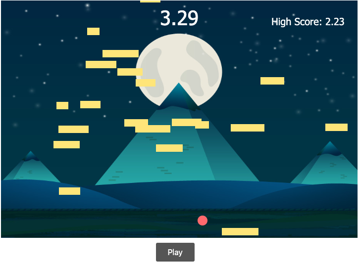

# simpleWebGame
https://celwebgame.glitch.me/ 

Falling rectangle user has to dodge with mouse. Used HTML, CSS and JavaScript.  
If user gets hit by rectangle then score is displayed.  

# What I Learned

* Implementing JavaScript into a website to create game

